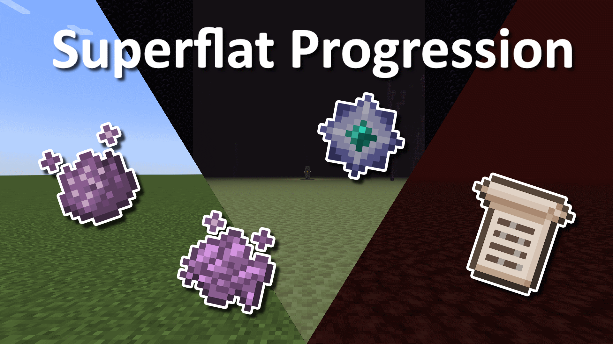

# Superflat Progression
Makes certain items/blocks/dimensions which were previously inaccessible in structureless superflat available. Adds quality of life features to alleviate the more tedious aspects of Superflat. Should also make for a good skyblock playthrough as well!

## Features

### Pixies
Pixies are passive mobs which come out only at night. Their pixie dust is used to craft magic torches, enriched bonemeal, magic scrolls, and most importantly, purple dye.
Magic torches increases the likelihood of getting rare item drops when killing mobs nearby. Compared to looting, this only increases the likelihood of getting drops, while looting can also increase the number (the two effects stack together).
Enriched bonemeal can be used on grass, sand, soul sand, or underwater to conjure up oak saplings, cacti, sugar cane, netherwart, etc. It also acts as regular bonemeal on crops but within a larger area of effect.

### The Scriptorium
A new magic system centered around using pixie dust and experience points to make magic scrolls. Scrolls are made using paper or parchment, a new material made from leather.
Scrolls can be used to change the weather, summon wandering traders, or summon various hostile or passive mobs.

### The Pulverizer
A new crafting station which breaks items down into their constitient parts. For example: 
- Spectral arrows and fire chargers from Piglin bartering can be converted to glowstone dust and blaze powder, respectively.
- Diamond armor and tools from traders can be converted to diamond shards and crafted back into diamonds.
- Ore blocks can be converted into a higher amount of ores (wait that's useless in Superflat).
- Dye ingredients can be converted at a higher yield
- Cobblestone can be turned to gravel, and gravel to sand. Magma blocks can be converted to lava, sould soil to sould sand.
- Ender Pearls can be turned into End Dust, used to craft End Stone (required for End Portal Frame Generator) or a spatial instablity potion (teleports the target randomly for its duration).
- Other recipes: Wool into string, ice into snowballs, snow blocks into powdered snow, furnace back into cobblestone.

The pulverizer can be automated using hoppers and redstone: The hopper on top supplies ingredients, hoppers on the sides supply buckets if required, and it places items into the storage container in front of it. It must be powered by a redstone pulse for each item it processes.  

### Quality of life improvements
- Bone tools offer an intermediary between stone and iron tools.
- When a log is burnt surrounded by at least 4 other blocks it has a chance of turning into a charcoal block. A single-use firestarter may be made with string and sticks.
- Rotten flesh can be smelted or cooked on a campfire to make leather. Good for armour and parchments!
- Budding amethyst can be made using an amethyst block and pixie dust.
- Many new wandering trader offers: Amethyst shards, sea lanterns, prismarine blocks, Sniffer eggs, buckets of axolotl and tadpoles.
- Reclaim glass bottles dropped by Witches to get glass blocks by smelting them.
- Using a water bottle on a magma block now converts it to cobblestone.
- Slimes transform into magma cubes when struck by lightning. Use their magma cream to make magma blocks, giving access to cobblestone and lava.
- Witches will sometimes drop bottles of water, which can be reclaimed for buckets in a cauldron.
- Dirt can be crafted into slabs, which grow grass appropriately. More materials for blocking slimes from spawning!
- Fishing can now give you bamboo even outside jungle biomes.
- Soul soil can be crafted using mud and pixie dust, and converted to soul sand using a grinder.
- Endermen will rarely spawn in holding end stone or nylium.
- Craftable Elytra recipe that uses an Ender Star dropped by defeating the Ender Dragon.
- Includes advancements and supports REI to guide progression.

### Other Dimensions
- **The Nether is now Superflat when the Superflat world preset is chosen**
- Ancient debris still spawns underground in the superflat Nether.
- If structures are disabled then Blazes, Wither Skeletons, and Piglin Brutes will spawn outside of their respective structures. Piglin Brutes will have a 1 in 20 chance of dropping Netherite upgrade templates.
- An End portal can be created using an End Portal Frame Generator block, crafted with diamonds, obsidian, End stone, and a Eye of Ender. Activate it by placing an End Crystal on top and destroying it, if there is adequate space nearby.

### Mod compatibility
If played with my Peaceful Progression mod the pulverizer will work for some dye recipes, enriched bone meal will produce flax seeds, and both ghastlings and end clams will spawn in the Nether without structures. That said, you will not be able to progress without hostile mobs spawning.

REI is supported which provides both recipe information and some additional info about certain blocks and items.

## How to progress
Many elements of the original Superflat progression are maintained, just with ways of speeding certain tedious parts up. New progression is meant to continue in the spirit of original Superflat without removing the unique nature of it.

1. First, you want enriched bonemeal. Kill skeletons and pixies the first night to craft this, and use it to get plants and, most importantly, oak saplings.
2. With access to wood you can now get charcoal (see QoL), allowing you to craft a magic torch from pixie dust to increase rare mob drops.
3. Convert rotten flesh to leather on a campfire for armor, and use wood and bones to create better tools.
4. Craft a Scriptorium using parchment (leather) and wood. If you have no pigs be sure to summon some now and start breeding them up with carrots, they will be important later!
5. Create a mob spawner and spawn-proof slime chunks. Keep a magic torch nearby!
6. Kill zombies to collect iron for a cauldron and a bucket. Create a Scroll of Rain to fill your cauldron or kill witches for water bottles. 
7. With access to water, convert zombies into drowned to get copper.
8. Use copper to make lightning rods and Scrolls of Thunder. Place a lightning rod near pigs or slime to get zombie piglins and mamga cubes, unlocking gold and magma blocks.
9. Convert magma blocks into cobblestone using water bottles. Get enough for a furnace, and craft a pulverizer using your gold. Pulverize magma blocks into lava buckets and make a cobblestone generator.
10. Collect two zombie villagers and a witch. Standing near the witch, have her throw weakness potions at you so that the zombies get hit as well. Feed them golden apples to convert to regular villagers. Alternatively, farm enough Magma Cubes to get enough lava for a Nether portal and start your own potion production to not have to use a witch.
11. Either farm enough magma cubes to get lava for a Nether portal, or get dripstone from a summoned wandering trader to make a lava generator (now that you have villagers as a source of emeralds).
12. Trade with your villagers for diamond gear that can be pulverized down into diamond shards (toolsmith has a pretty cheap trade for a diamond hoe).
13. Craft an End Portal Frame Generator, activate it by placing an End Crystal on top and destroying it.
14. Prepare for the Ender Dragon fight - brew potions, get gear from an iron farm using your villagers, buy diamond gear from them, etc.
15. Beat the game!
16. Post-End you can also defeat the Wither (brutally hard in Superflat, nowhere to hide and it constantly regens health by killing slimes), upgrade your gear to full Netherite, or craft an Elytra (or just get one if structures enabled).

